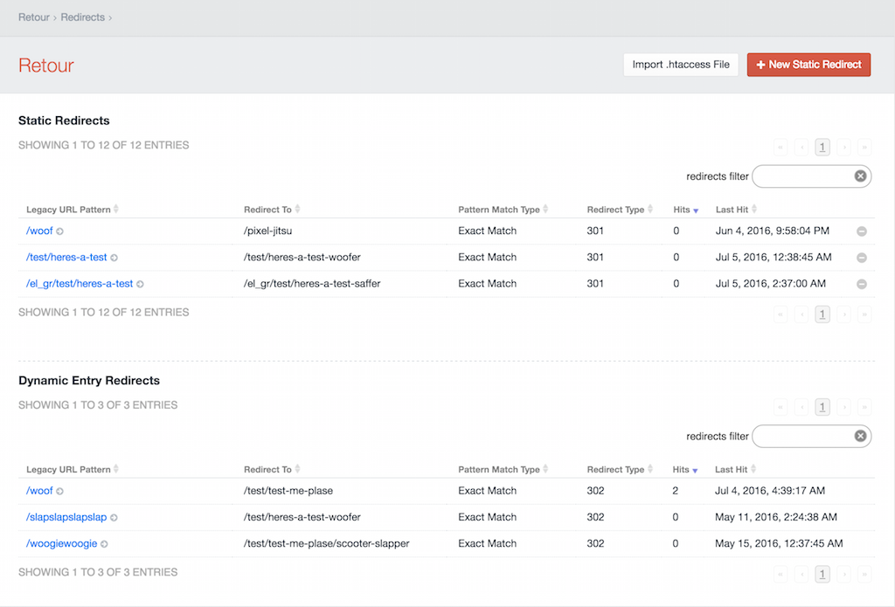
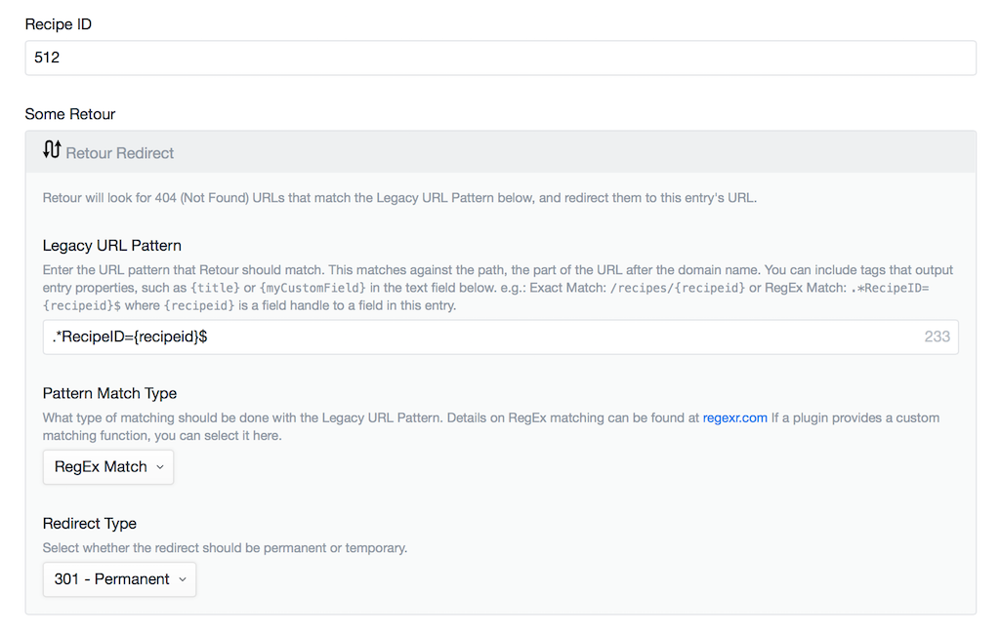
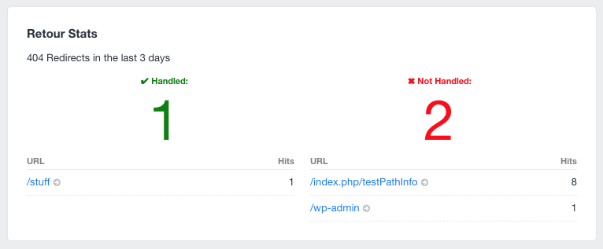

# Retour plugin for Craft CMS

Retour allows you to intelligently redirect legacy URLs, so that you don't lose SEO value when rebuilding & restructuring a website.

## Installation

To install Retour, follow these steps:

1. Download & unzip the file and place the `retour` directory into your `craft/plugins` directory
2.  -OR- do a `git clone https://github.com/nystudio107/retour.git` directly into your `craft/plugins` folder.  You can then update it with `git pull`
3.  -OR- install with Composer via `composer require nystudio107/retour`
4. Install plugin in the Craft Control Panel under Settings > Plugins
5. The plugin folder should be named `retour` for Craft to see it.  GitHub recently started appending `-master` (the branch name) to the name of the folder for zip file downloads.

Retour works on Craft 2.4.x, Craft 2.5.x, and Craft 2.6.x.

## Retour Overview

Retour allows you to intelligently redirect legacy URLs, so that you don't lose SEO value when rebuilding & restructuring a website.

In addition to supporting traditional exact and RegEx matching of URL patterns, Retour also has a Retour Redirect FieldType that you can add to your entries. This allows you to have dynamic entry redirects that have access to the data in your entries when matching URL patterns.

Retour will also automatically create a redirect for you if you change an entry's slug.

Retour is written to be performant. There is no impact on your website's performance until a 404 exception happens; and even then the resulting matching happens with minimal impact.

Don't just rebuild a website. Transition it with Retour.

## Why Use a Plugin for Redirects?

If you have just a few static redirects, then your best bet is to put them in your `.htaccess` file, or better yet, in your `.conf` file for your virtual host.  However, there are a number of cases where using a plugin to handle it is a **better** solution:

1. If you have a large number of redirects, it will slow down every single request your web server handles unnecessarily if they are in `.htaccess` or `.conf`
2. Often the URL patterns from the legacy website do not match the new website URLs in a deterministic way, which makes creating redirects difficult
3. Sometimes you don't have access to the server config files, or you want to give your client the ability to manage redirects easily

Retour solves these problems:

1. Retour only attempts to do a redirect after the web server has already thrown a 404 exception.  Once a redirect mapping is successfully determined, it also caches the result for speedy resolution of the next redirect request.
2. Retour also gives you the ability to do Dynamic Entry Redirects that allow you to import a piece of legacy data into your entries to use as a key for determining the new URL mapping.  In this way, utterly dissimilar URLs can be mapped for redirection effectively.
3. It provides an easy to use GUI that the client can use from Craft's AdminCP, and keeps statistics on the 404 hits (and misses)

## Dynamic Entry Redirects

Retour implements a Retour Redirect FieldType that you can add to your Entry Types.  Retour will look for 404 (Not Found) URLs that match the Legacy URL Pattern, and redirect them to this entry's URL.

You also get the context of the `entry` that you can use when matching legacy URLs; so if you've imported a field called `recipeid` into your new website, you can the Retour Redirect FieldType look for it in your Legacy URL Pattern, e.g.: `/old-recipes/{recipeid}`

This allows you to can key off of a piece of legacy data that was imported, for the cases when the new URL patterns don't look anything like the Legacy URL Patterns, or follow any pattern that RegEx is useful for matching.

### Creating a Retour Redirect Field

Create a Retour Redirect field as you would any other field; then set the default values for it.  For new entries, it will default to the values entered here, so you can put your matching pattern in once, rather than having to do it for each entry.

* **Default Legacy URL Pattern** - Enter the URL pattern that Retour should match. This matches against the path, the part of the URL after the domain name. You can include tags that output entry properties, such as `{title}` or `{myCustomField}` in the text field below. e.g.: Exact Match: `/recipes/{recipeid}` or RegEx Match: `.*RecipeID={recipeid}$` where `{recipeid}` is a field handle to a field in this entry.
* **Default Pattern Match Type** - What type of matching should be done with the Legacy URL Pattern. Details on RegEx matching can be found at [regexr.com](http://regexr.com) If a plugin provides a custom matching function, you can select it here.
* **Default Redirect Type** - Select whether the redirect should be permanent or temporary.
* **Redirect Changeable** - Whether to allow the user to change the redirect while editing the entry.

### Configuring a Retour Redirect Field

* **Legacy URL Pattern** - Enter the URL pattern that Retour should match. This matches against the path, the part of the URL after the domain name. You can include tags that output entry properties, such as `{title}` or `{myCustomField}` in the text field below. e.g.: Exact Match: `/recipes/{recipeid}` or RegEx Match: `.*RecipeID={recipeid}$` where `{recipeid}` is a field handle to a field in this entry.
* **Pattern Match Type** - What type of matching should be done with the Legacy URL Pattern. Details on RegEx matching can be found at [regexr.com](http://regexr.com) If a plugin provides a custom matching function, you can select it here.
* **Redirect Type** - Select whether the redirect should be permanent or temporary.

**Note:** if you add a Retour Redirect FieldType to an existing Section, or you import data from a foreign source into a Section with a Retour Redirect FieldType, the default values you set for the Retour Redirect FieldType will not be propagated to the entry yet.  To cause that to happen, go to **Settings->Sections** then click on the Section to edit it, and hit **Save**.  This will cause all of the entries in that section to be re-saved, and Retour will fill in the default field values.

### Multiple Redirects to the Same Entry

If you need more than one Legacy URL Pattern to redirect to a given entry, simply create a new Retour Redirect field (so that you get a new set of default options) and add it to your Entry Type layout.  You can add as many as you like.

## Static Redirects

Static Redirects are useful when the Legacy URL Patterns and the new URL patterns are deterministic.  You can create them by clicking on **Retour->Redirects** and then clicking on the **+ New Static Redirect** button.

* **Legacy URL Pattern** - Enter the URL pattern that Retour should match. This matches against the path, the part of the URL after the domain name. e.g.: Exact Match: `/recipes/` or RegEx Match: `.*RecipeID=(.*)`
* **Destination URL** - Enter the destination URL that should be redirected to. This can either be a fully qualified URL or a relative URL. e.g.: Exact Match: `/new-recipes/` or RegEx Match: `/new-recipes/$1`
* **Pattern Match Type** - What type of matching should be done with the Legacy URL Pattern. Details on RegEx matching can be found at [regexr.com](http://regexr.com) If a plugin provides a custom matching function, you can select it here.
* **Redirect Type** - Select whether the redirect should be permanent or temporary.

### Renamed Slug Redirects

If you rename an entry's `slug` (and the Section the entry is in has URLs), Retour will automatically create a static redirect for you to keep traffic going to the right place.  It will appear listed under the "Static Redirects" section like any other static redirect.

## Retour Statistics

Retour keeps track of every 404 your website receives.  You can view them by clicking on **Retour->Statistics**.  

Only one record is saved per URL Pattern, so the database won't get clogged with a ton of records.

### Retour Widget

If you'd like to see an overview of the Retour Statistics in your dashboard, you can add a Retour widget to your Dashboard:

It displays the total number of handled and not handled 404s, and the 5 most recent 404 URLs in each category right in your dashboard.

## Developer Info

### Custom Match Functions via Plugin

Retour allows you to implement a custom matching function via plugin, if the Exact and RegEx matching are not sufficient for your purposes.

In your main plugin class file, simply add this function:

    /**
     * retourMatch gives your plugin a chance to use whatever custom logic is needed for URL redirection.  You are passed
     * in an array that contains the details of the redirect.  Do whatever matching logic, then return true if is a
     * matched, false if it is not.
     *
     * You can alter the 'redirectDestUrl' to change what URL they should be redirected to, as well as the 'redirectHttpCode'
     * to change the type of redirect.  None of the changes made are saved in the database.
     *
     * @param mixed An array of arguments that define the redirect
     *            $args = array(
     *                'redirect' => array(
     *                    'id' => the id of the redirect record in the retour_redirects table
     *                    'associatedElementId' => the id of the entry if this is a Dynamic Entry Redirect; 0 otherwise
     *                    'redirectSrcUrl' => the legacy URL as entered by the user
     *                    'redirectSrcUrlParsed' => the redirectSrcUrl after it has been parsed as a micro template for {variables}
     *                        via renderObjectTemplate().  This is typically what you would want to match against.
     *                    'redirectMatchType' => the type of match; this will be set to your plugin's ClassHandle
     *                    'redirectDestUrl' => the destination URL for the entry this redirect is associated with, or the
     *                        destination URL that was manually entered by the user
     *                    'redirectHttpCode' => the redirect HTTP code (typically 301 or 302)
     *                    'hitCount' => the number of times this redirect has been matched, and the redirect done in the browser
     *                    'hitLastTime' => the date and time of the when this redirect was matched
     *                    'locale' => the locale of this redirect
     *                )
     *            );
     * @return bool Return true if it's a match, false otherwise
     */
    public function retourMatch($args)
    {
        return true;
    }

Your plugin will then appear in the list of Pattern Match Types that can be chosen from via Retour->Redirects or via the Retour Redirect FieldType.

### Utility Functions

`craft.retour.getHttpStatus` in your templates will return the HTTP Status code for the current template, so you can display a special message for people who end up on a page via a `301` or `302` redirect.

## Retour Roadmap

Some things to do, and ideas for potential features:

* More interesting statistics tracking

## Retour Changelog

### 1.0.12 -- 2016.07.02

* [Improved] We now store the destination for redirects in the FieldType as a URI rather than a URL, so that it's more portable across environments
* [Improved] Updated the README.md

### 1.0.11 -- 2016.06.21

* [Fixed] Fixed an issue with URLs that have umlauts in them
* [Fixed] Fixed an issue with URLs that are longer than 255 characters for the redirect statistics
* [Improved] Statistics are now limited to the top 1,000 hits
* [Improved] Updated the README.md

### 1.0.10 -- 2016.06.15

* [Added] Retour will attempt to prevent redirect loops when saving a new redirect by deleting any existing redirects that have the destUrl as their srcUrl
* [Added] Added a 410 - Gone redirect http code for permanently removed resources
* [Improved] Updated the README.md

### 1.0.9 -- 2016.06.04

* [Added] Retour will now automatically create a static redirect for you if you rename an entry's slug
* [Improved] Retour checks to ensure that no two redirects have the same redirectSrcUrl
* [Improved] The Statistics page handles really long URLs better now
* [Improved] If you save a redirect, either static or dynamic, with an empty Legacy URL Pattern, retour now deletes it
* [Improved] Updated the README.md

### 1.0.8 -- 2016.05.30

* [Improved] Revamped Retour to key off of the ElementID rather than the EntryID
* [Fixed] Fixed an issue with Retour and MySQL running in strict mode (which is the default in 5.7+)
* [Fixed] Retour will no longer try to save a record with a null id (caused a CDbCommand exception)
* [Fixed] A '/' isn't prepended to empty src URLs anymore
* [Improved] Updated the README.md

### 1.0.7 -- 2016.05.07

* [Improved] getRequestUri() is now explicitly used, and we immediately terminate the request upon redirect
* [Improved] We now pass in 0 instead of null for the cache duration
* [Improved] We now explicitly check for CHttpException
* [Improved] Updated the README.md

### 1.0.6 -- 2016.04.29

* [Fixed] Fixed a Javascript error with the FieldType Javascript
* [Fixed] Fixed a visual display glitch with the tabs on Craft 2.4.x
* [Improved] Updated the README.md

### 1.0.5 -- 2016.04.28

* [Added] Added a 'Clear Statistics' button to the Statistics page
* [Fixed] Fixed a bug when using RegEx for static redirects that would cause them to not work
* [Fixed] Fixed an issue with Craft 2.4.x
* [Improved] Updated the README.md

### 1.0.4 -- 2016.04.28

* [Added] The tables in the Statistics and Redirects pages are now sortable by any column
* [Improved] Fixed up the localization support for the FieldType
* [Improved] Minor changes/fixes to the plugin
* [Improved] Updated the README.md

### 1.0.3 -- 2016.04.27

* [Added] Added a Retour Stats widget
* [Added] Added information on the Statistics tab as to whether Retour handled the 404 or not
* [Improved] Updated the README.md

### 1.0.2 -- 2016.04.26

* [Fixed] Fixed faulty indexes that could cause Retour Redirect FieldTypes to not work properly
* [Improved] Spiffy new icon
* [Improved] Changing the display name of the plugin is now more globally applied
* [Improved] Updated the README.md

### 1.0.1 -- 2016.04.26

* [Added] Implemented a caching layer so that once a redirect has been determined, subsequent redirects are cached and immediately returned
* [Added] Added the ability to delete static redirects
* [Added] Added Composer support
* [Improved] Updated the README.md

### 1.0.0 -- 2016.04.25

* Initial release

Brought to you by [nystudio107](http://nystudio107.com)